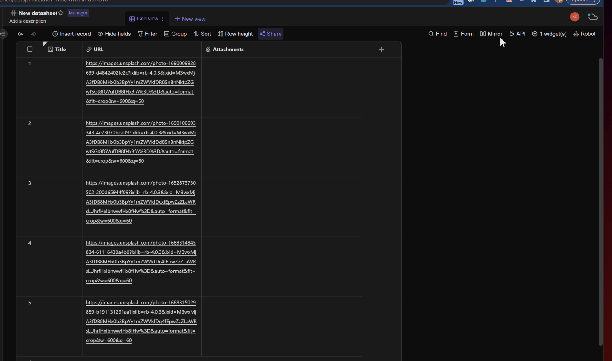

# APITable Url to Image Converter

<p align='center'>
  <image src="logo/logo-48.png" />
</p>

<p align='center'>
  <image src="https://img.shields.io/badge/License-MIT-yellow.svg" />
</p>

<p align="center">
  <a href="README.md">English</a>
  |
  <a href="README_CN.md">简体中文</a>
</p>

This is a browser extension that extracts images from URLs and uploads them to APITable.

- ✨ You can extract images from URL addresses and save them to the "Attachment" field.
- ✨ Supports processing multiple URLs separated by commas (in a single cell), enabling multiple attachments to be saved in the same cell.
- ✨ Beginner-friendly, developed using basic HTML, JavaScript, and CSS, without requiring knowledge of frameworks like React or Vue.

## Preview



## Installation

1. Clone the project locally:

  ```bash
  git clone https://github.com/kwp-lab/apitable-url-to-image.git
  ```

2. Open the extensions management page in Chrome ([chrome://extensions](chrome://extensions)).

3. Turn on developer mode.

4. Click "Load unpacked" and select the folder you just cloned. ([Guide]((https://developer.chrome.com/docs/extensions/mv3/getstarted/development-basics/#load-unpacked)))

Installation is complete.

## Configuration

Before using the extension, follow these steps to set your API access credentials and host information:

1. Open the extension's options page.
If you can't find the options page, right-click the extension icon and click button "Options".

2. In the options page, enter your APITable API Token and API Host information.
If you don't have an API Token yet, you can register and obtain one on the [APITable website](https://apitable.com/).

3. Save the settings and return to the extension's pop-up page.

## Usage

1. Visit [APITable.com](https://apitable.com/) and open the datasheet to be processed.

2. Click the icon of this extension to bring up the operation interface. Select which field to read the URL information from and specify which attachment field to save the image data collected from the URL.

    > Tip 1: URLs must be stored in fields of the following three types: "Single Line Text", "Long Text", and "URL". Other field types will be filtered out and will not appear in the drop-down selection box.

    > Tip 2: You must first open the APITable.com datasheet link and then start the browser extension. Otherwise, the extension will be unable to get the field list of the datasheet.

3. After confirming that everything is correct, click the "conver" button, and the extension will begin extracting images and saving to "attachments" field in the background (extension service worker).

    > Tip: Since this is done in the background, you can close the extension popup window and even the currently active APITable webpage after starting the process. The image extraction and attachment conversion will continue to function normally (but you cannot close the browser...).

## FAQ

**Q: Can other file formats be extracted and saved to APITable?**
A: Yes. As long as the URL points to a file that can be directly downloaded by the browser, whether it's a PDF or an mp4, it can be converted using this extension.

**Q: Some URLs fail to be converted successfully. How can I check the logs or debug?**
A: Right-click on the extension pop-up window and select "Inspect" from the menu to view the log messages through the console. Or open the console of the service worker to view the background running logs.

## Contribution

Contributions in the form of code, reporting issues, and suggestions are welcome.

## License

This project is licensed under the MIT License. See the [LICENSE](LICENSE) file for more information.
