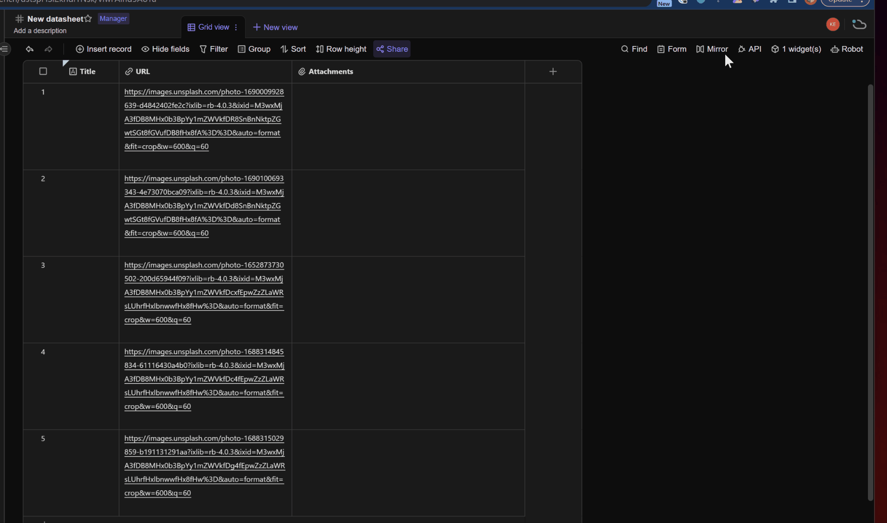

# AITable Url to Image Converter

<p align='center'>
  <image src="logo/logo-48.png" />
</p>

<p align='center'>
  <image src="https://img.shields.io/badge/License-MIT-yellow.svg" />
</p>

<p align="center">
  <a href="README.md">English</a>
  |
  <a href="README_CN.md">简体中文</a>
</p>

以浏览器扩展程序的形式，实现从URL中提取图像并将其上传到 AITable 的能力。

- ✨ 支持 AITable/维格表的整表读取，将URL地址对应的文件下载并转存至“附件”字段当中；
- ✨ 支持以“,”分隔的多个URL文本处理（单个单元格内），实现多附件转存至同一单元格内；
- ✨ 对入门级开发者友好，使用基础HTML，JavaScript，CSS开发而成，无需掌握React、Vue等框架

## 效果预览



## 安装

1. 将项目 clone 到本地：

  ```bash
  git clone https://github.com/kwp-lab/apitable-url-to-image.git
  ```

2. 在 Chrome 中打开扩展程序管理页面（地址为 `chrome://extensions`）。

3. 打开开发者模式。

4. 点击“加载已解压的扩展程序”，然后选择刚刚 clone 到本地的文件夹。（[官方指南](https://developer.chrome.com/docs/extensions/mv3/getstarted/development-basics/#load-unpacked)）

完成安装。

## 配置

在开始使用之前，请按照以下步骤设置您的 API 访问凭证和主机信息：

1. 打开扩展程序的选项页面。
如果您无法找到选项页面，可以右键点击扩展程序的图标，然后选择“选项”。

2. 在 options 页面中，输入您的 AITable API Token 和 API Host 信息。
如果您还没有 AITable API Token，可以在 [AITable 官网](https://aitable.ai/) 注册并获取。

3. 保存设置并返回扩展程序的主页面。

## 使用步骤

1. 访问 aitable.ai, 打开待处理的表格。

2. 在浏览器扩展程序的区域，单击本扩展程序的图标，弹出操作界面。请选择从哪个字段里读取 URL 信息，并且指定从 URL 采集的图片数据保存至哪个附件字段中。

    > 提示1：URL必须要存储在“单行文本”，“多行文本”，“网址”这三种字段类型之中，其他类型字段会被过滤，不会出现在下拉选择框中.
    > 提示2：必须要先打开 aitable.ai 的表格链接，再启动浏览器扩展程序。否则程序无法抓取到表格的字段信息。

3. 确认无误后，点击按钮“conver”，扩展程序将会在后台（extension service worker）开始图片采集和转存附件的操作。

    > 提示：由于是在后台处理。因此执行开始后，你可以关闭程序弹窗，甚至关闭当前激活中的 AITable 网页，图片采集和转存附件工作仍会正常运作。（但不能关闭浏览器...）


## 常见问题

**Q：可以采集其他格式的文件并转存至 AITable/维格表吗？**
A：可以的。只要 URL 指向的是一个可被浏览器直接下载的文件，不管是PDF还是mp4，都可以通过本扩展程序进行转存。

**Q：有一些url无法成功转存成功，我应该如何查看日志或者调试？**
A: 请在扩展程序弹出框口右键，在菜单中选择“检查”，通过console查看日志消息。或者打开 service worker 的 console 查看后台运行日志。

**Q：该扩展程序可以在[维格表](https://vika.cn)里使用吗？**
A：可以的，在 options 页面修改 `API Host` 配置项，改为 `https://api.vika.cn`。

## 贡献

欢迎贡献代码、报告问题、提出建议等。

## 许可证

该项目使用 MIT 许可证。请查看 [LICENSE](LICENSE) 以获得更多信息。
